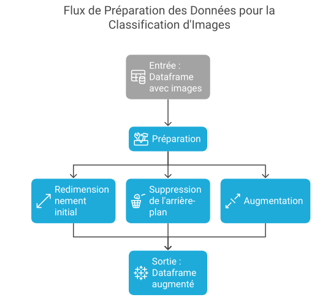
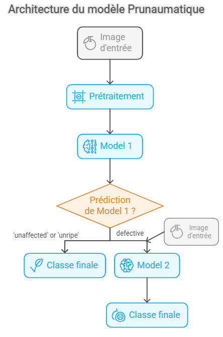

# PRUNAUMATIE (modele de classification de prunes)

Prunaumatique est une application un integre notre modele de deeplearning de classification de prunes en 06 categories (spotted, cracked, unripe, rotten, bruised, unaffected).

Premiers pas
Instructions pour obtenir une copie du projet et le faire fonctionner sur votre machine locale.
Prérequis
Liste des logiciels, bibliothèques ou matériels nécessaires pour exécuter ce projet.

Python : Version 3.11 ou supérieure.

Bibliothèques Python :

torch
torchvision
pandas
numpy
matplotlib
tqdm
gdown
scikit-learn Installez-les avec :

pip install torch torchvision pandas numpy matplotlib tqdm gdown scikit-learn

Accès à Google Drive : Pour télécharger le jeu de données (assurez-vous d'avoir les autorisations pour le fichier spécifié).

GPU (optionnel) : Recommandé pour accélérer l'entraînement. CUDA requis pour l'utilisation du GPU.

Installation
Guide étape par étape pour installer le projet.

Obtenir le projet :

Clonez le dépôt si disponible :
git clone <URL-du-dépôt>

Ou téléchargez le fichier notebook (JCIA_PRUNAUMATIQUE.ipynb) et placez-le dans un répertoire de travail.

Télécharger le jeu de données :

Exécutez le code suivant pour télécharger et décompresser le jeu de données depuis Google Drive :
!pip install -U gdown
import os

FILE_ID = "1UxMCTBZiQGXIQShuEAdaSKn2Y_hKnDQj"
os.makedirs("data", exist_ok=True)
!gdown {FILE_ID} -O data/dataset.zip
!unzip -q data/dataset.zip -d data/

Charger les données :

Chargez les données d'entraînement et de test dans des DataFrames Pandas :
import pandas as pd
import numpy as np
from PIL import Image
from tqdm import tqdm
import os

def load_raw_image(filepath):
    filename = os.path.basename(filepath)
    label = os.path.splitext(filename)[0].split('_')[0]
    img = Image.open(filepath).convert('RGB')
    img_array = np.array(img)
    return {'label': label, 'image': img_array}

# Données d'entraînement
train_dir = 'data/data_split/train'
data = []
for filename in tqdm(os.listdir(train_dir)):
    if filename.lower().endswith(('.png', '.jpg', '.jpeg')):
        filepath = os.path.join(train_dir, filename)
        data.append(load_raw_image(filepath))
df = pd.DataFrame(data)

# Données de test
test_dir = 'data/data_split/test'
data = []
for filename in tqdm(os.listdir(test_dir)):
    if filename.lower().endswith(('.png', '.jpg', '.jpeg')):
        filepath = os.path.join(test_dir, filename)
        data.append(load_raw_image(filepath))
df_test = pd.DataFrame(data)

Configurer l'environnement :

Ouvrez le notebook dans Jupyter Notebook, Google Colab, ou un environnement compatible.
Si vous utilisez Colab, activez le GPU : Modifier > Paramètres du notebook > Matériel accélérateur > GPU.

Utilisation
Instructions pour utiliser le projet ou ses fonctionnalités.

Visualiser les données :

Affichez des images aléatoires avec leurs étiquettes pour explorer le jeu de données :
import matplotlib.pyplot as plt
import random
import math

def show_random_images(df, n=8):
    n = min(n, len(df))
    indices = random.sample(range(len(df)), n)
    cols = 4
    rows = math.ceil(n / cols)
    fig, axes = plt.subplots(rows, cols, figsize=(4 * cols, 4 * rows))
    axes = axes.flatten()
    for i in range(rows * cols):
        ax = axes[i]
        if i < n:
            img = df.iloc[indices[i]]['image']
            label = df.iloc[indices[i]]['label']
            ax.imshow(img)
            ax.set_title(label, fontsize=10)
        ax.axis('off')
    plt.tight_layout()
    plt.show()

show_random_images(df, n=12)

Évaluer les modèles :

Chargez les modèles sauvegardés et évaluez leurs performances :
import torch
from torchvision import transforms

combined = CombinedModel(model1, model2)
test_transform = transforms.Compose([
    transforms.Resize((224, 224)),
    transforms.CenterCrop(224),
    transforms.ToTensor(),
    transforms.Normalize([0.485, 0.456, 0.406], [0.229, 0.224, 0.225])
])
results = evaluate_combined_model(combined, df_test, test_transform, device='cuda')
print(f"Accuracy: {results['accuracy']:.4f}")

Sauvegarder les modèles :

Sauvegardez les modèles entraînés pour une réutilisation future :
import torch
torch.save({'model_state_dict': model1.state_dict()}, 'resnet_model1.pth')
torch.save({'model_state_dict': model2.state_dict()}, 'resnet_model2.pth')

Contribution
Directives pour contribuer au projet.

Fork du projet :

Créez une copie du dépôt sur votre compte GitHub.

Créez une branche :

Travaillez sur une branche spécifique pour vos modifications :
git checkout -b feature/nouvelle-fonctionnalite

Effectuez vos modifications :

Ajoutez des fonctionnalités, corrigez des bugs ou améliorez la documentation.
Assurez-vous que le code respecte les standards de PEP 8 et inclut des tests si applicable.

Soumettez une Pull Request :

Poussez vos modifications et créez une pull request vers le dépôt principal.
Décrivez clairement vos changements et leur objectif.

Respectez les conventions :

Les contributions doivent être compatibles avec les dépendances existantes.
Testez vos modifications localement avant de soumettre.

